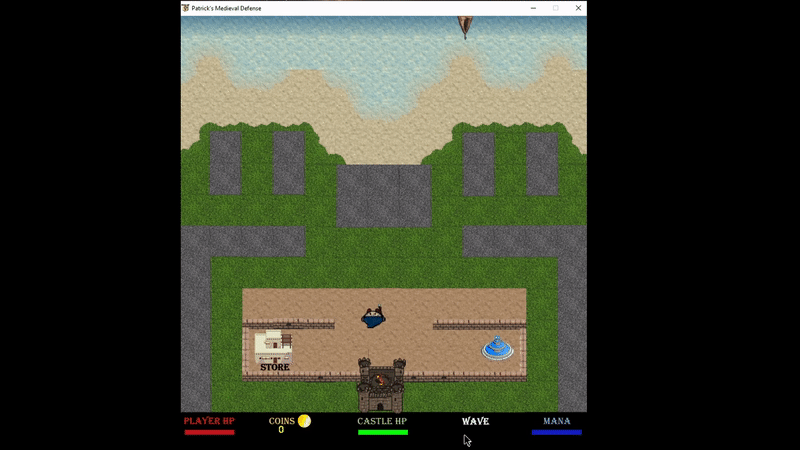

# Defense Game
Development of a video game (in-prog) for the purposes of learning python syntax/semantics and to have a good time. <br>
This game is inspired by web flash games played in my childhood :)

## How to Run
Platform: [](https://svgshare.com/i/ZhY.svg)  [](https://svgshare.com/i/Zhy.svg)
1. Have Python 3.xx Intalled 
2. Install requirements.txt
``` 
unix$ pip install requirements.txt
```
3. Run python file
```
$ python3 run_game.py
```

## How to Play
**Goal**: Defend the user's base from oncoming enemies.

**Controls:** Arrow keys for movement. Spacebar for fire.

## Gameplay 


## Development Environment
* Program utilizes pygame library and other python std libraries
* Preferred code editor - VSCode
* Sprites, backgrounds, animation, etc, were created using [OpenGameArt.org](https://opengameart.org)

## Current Progress
1. Enemies arrive in "waves"
2. Only 1 "wave" exists atm
3. Enemies have animation in movement
4. Hero can walk and fire
5. Enemies deal damage to hero base if reached
6. Mana regenerates, and limits user fire